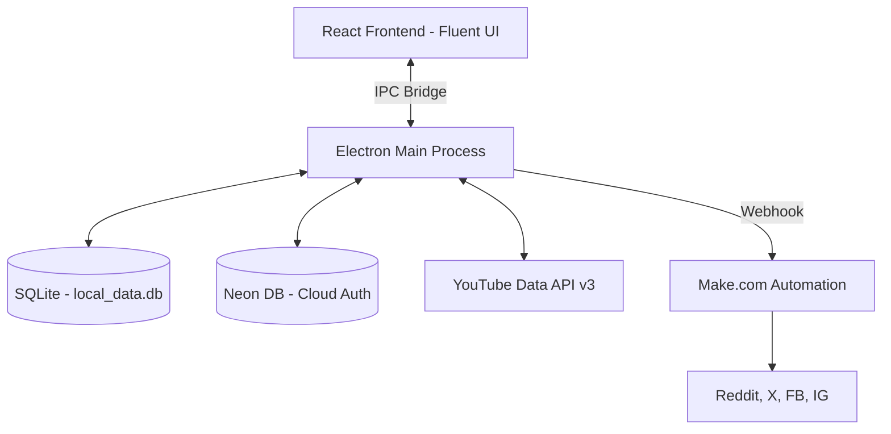

# Documentación Técnica: Syncro (YouTube AutoPublisher)

## 1. Resumen Ejecutivo
**Syncro** es una aplicación de escritorio multiplataforma (Electron) diseñada para creadores de contenido que buscan automatizar la distribución de sus videos de YouTube en redes sociales. 

La aplicación permite vincular canales de YouTube, monitorizar sus videos (incluyendo Shorts y Directos), y programar o lanzar publicaciones automáticas hacia plataformas como **Reddit, X (Twitter), Facebook e Instagram** utilizando una arquitectura delegada en **Make.com**.

---

## 2. Arquitectura General
La aplicación sigue el patrón estándar de Electron con una separación clara entre el proceso principal y el de renderizado.

### Diagrama de Arquitectura (Conceptual)


### Componentes Clave
1.  **Renderer Process (React)**: Interfaz de usuario de alta fidelidad construida con Fluent UI y Framer Motion.
2.  **Main Process (Node.js)**: Gestor de lógica de negocio, acceso a sistema de archivos y base de datos.
3.  **IPC Bridge (Preload)**: Puente seguro que expone funciones específicas al frontend sin comprometer la seguridad de Node.js.
4.  **Local Storage (SQLite)**: Almacena credenciales encriptadas, caché de videos y configuraciones locales.
5.  **Cloud Registry (Neon)**: Sistema centralizado para autenticación de usuarios y control de licencias por dispositivo (MAC Address).

---

## 3. Stack Tecnológico

| Tecnología | Versión | Justificación |
| :--- | :--- | :--- |
| **Electron** | 32.0.1 | Base para la aplicación de escritorio con acceso a Node.js. |
| **React** | 18.3.1 | Framework para la interfaz de usuario. |
| **Vite** | 5.4.2 | Bundler moderno para un desarrollo rápido. |
| **Fluent UI** | 9.54.12 | Sistema de diseño de Microsoft para una estética premium y consistente. |
| **Zustand** | 4.5.5 | Gestión de estado ligera y eficiente. |
| **Better-SQLite3** | 12.9.0 | Motor de base de datos local rápido y síncrono para Node.js. |
| **Neon** | Serverless | Base de datos PostgreSQL en la nube para autenticación global. |
| **Framer Motion** | 12.38.0 | Motor de animaciones para transiciones cinematográficas. |
| **Zod** | 3.23.8 | Validación de esquemas y tipos de datos. |

---

## 4. Estructura de Directorios

```text
/
├── electron/               # Proceso principal de Electron
│   ├── ipc/                # Handlers de comunicación entre UI y Sistema
│   │   ├── auth.js         # Registro y Login (Neon DB)
│   │   ├── history.js      # Gestión de logs locales
│   │   ├── publish.js      # Lógica de envío a Make.com
│   │   ├── social.js       # Configuración de redes sociales
│   │   └── youtube.js      # Interacción con YouTube API
│   ├── main.js             # Punto de entrada de la aplicación
│   └── preload.cjs         # Bridge de seguridad (ContextBridge)
├── lib/                    # Librerías y utilidades compartidas
│   ├── crypto.js           # Encriptación AES-256-CBC
│   ├── db.js               # Conexión a Neon (Nube)
│   ├── localDb.js          # Gestión de SQLite (Local)
│   ├── mac.js              # Utilidades de ID de máquina
│   ├── make.js             # Cliente para webhooks de Make.com
│   └── youtube.js          # Cliente para YouTube API
├── src/                    # Frontend (React)
│   ├── components/         # Componentes UI reutilizables
│   ├── pages/              # Vistas principales (Login, Channels, etc.)
│   ├── store/              # Estados globales (Zustand)
│   └── styles/             # Estilos CSS globales y temas
└── scripts/                # Scripts de utilidad (migraciones, etc.)
```

---

## 5. Módulos y Componentes Principales

### A. Capa de Datos Local (`lib/localDb.js`)
Gestiona la persistencia de datos sensibles y caché.
-   **Propósito**: Proveer una interfaz de base de datos SQL persistente en la carpeta de usuario (`userData`).
-   **Tablas principales**:
    -   `youtube_accounts`: API Keys y metadata de canales.
    -   `video_cache`: Almacén local para evitar llamadas excesivas a la API de YouTube.
    -   `social_accounts`: Credenciales encriptadas para Make.com y parámetros de plataformas.
    -   `publish_logs`: Historial de intentos y éxitos de publicación.
-   **Patrón**: Migraciones automáticas al inicio de la aplicación para asegurar consistencia del esquema.

### B. Seguridad y Encriptación (`lib/crypto.js`)
Asegura que los datos guardados en el disco no sean legibles en texto plano.
-   **Algoritmo**: `aes-256-cbc`.
-   **Clave**: Derivada de una variable de entorno o del ID único del hardware (Machine ID).
-   **API**:
    -   `encrypt(text)`: Retorna `iv:encrypted_data`.
    -   `decrypt(text)`: Recupera el string original.

### C. Gestor de Publicación (`electron/ipc/publish.js`)
El cerebro de la distribución de contenido.
-   **Lógica**:
    1.  Recupera la plantilla de caption configurada para la plataforma.
    2.  Reemplaza variables dinámicas como `{titulo}` y `{url}`.
    3.  Obtiene las credenciales de Make.com configuradas para el canal.
    4.  Envía un payload JSON estructurado al Webhook de Make.

---

## 6. Flujos Principales

### Autenticación y Control de Dispositivos
1.  El usuario intenta loguearse.
2.  La aplicación obtiene el `Machine ID` (MAC abstracta) del hardware actual.
3.  Se verifica en **Neon DB** que el usuario exista y que el dispositivo esté vinculado (máximo 3 slots).
4.  Si es un dispositivo nuevo y hay slots libres, se registra automáticamente.

### Publicación de Video
1.  El usuario selecciona un video desde la vista de `Videos`.
2.  Selecciona las plataformas de destino (Reddit, X, etc.).
3.  La aplicación recupera la configuración de **Make.com** específica para ese canal de YouTube.
4.  Se dispara el webhook y se registra el resultado en el historial local.

---

## 7. Configuración y Variables de Entorno
Crea un archivo `.env` en la raíz con:
```env
DATABASE_URL=postgresql://... # URL de Neon DB
ENCRYPTION_KEY=...            # Clave de 32 caracteres (opcional)
```

---

## 8. Guía de Inicio Rápido
1.  **Instalación**: `npm install`
2.  **Migración de Nube**: `npm run migrate` (Para preparar la tabla de usuarios en Neon)
3.  **Desarrollo**: `npm run electron:dev`
4.  **Producción**: `npm run build`

---

## 11. Inventario de la Base de Código

### A. Proceso Principal (Electron)

#### `electron/main.js`
- **Propósito**: Punto de entrada de la aplicación. Configura la ventana principal, inicializa la DB local y registra los handlers de IPC.
- **Funciones**:
    - `createWindow()`: Crea la ventana de Electron con configuración de seguridad (`contextIsolation`, `sandbox: false`).
- **Dependencias**: `electron`, `path`, `fs`, `localDb.js`, Handlers de IPC.
- **Patrones**: Singleton para la ventana principal, carga de `preload.cjs` absoluta.

#### `electron/preload.cjs`
- **Propósito**: Puente de comunicación seguro. Expone la API `electronAPI` al proceso de renderizado.
- **API Expuesta**: `send`, `invoke`, `on`, `off`.
- **Seguridad**: Valida los nombres de los canales permitidos (`validChannels`) antes de enviarlos.

#### `electron/ipc/auth.js`
- **Propósito**: Gestión de identidad y seguridad de dispositivos.
- **Handlers**:
    - `auth:register`: Crea usuario en Neon DB y vincula el primer slot de MAC.
    - `auth:login`: Valida credenciales y gestiona la auto-vinculación de hasta 3 dispositivos.

#### `electron/ipc/publish.js`
- **Propósito**: Formateo y envío de publicaciones.
- **Handlers**:
    - `publish:video`: Recupera plantillas, procesa variables (`{titulo}`, `{url}`) y dispara el webhook de Make.com. Registra el éxito o fallo en `publish_logs`.

#### `electron/ipc/social.js`
- **Propósito**: Gestión de credenciales de redes sociales.
- **Handlers**:
    - `social:saveAccount`: Encripta y guarda credenciales en SQLite.
    - `social:getAccountsStatus`: Retorna qué redes están configuradas para el canal actual.

#### `electron/ipc/youtube.js`
- **Propósito**: Puente con la API de YouTube y gestión de caché.
- **Handlers**:
    - `youtube:getVideos`: Consulta caché local primero; si no existe o se requiere refresco, consulta la API oficial y purga la caché antigua.

---

### B. Librerías (`lib/`)

#### `lib/localDb.js`
- **Propósito**: Abstracción sobre SQLite.
- **Funciones**:
    - `initLocalDb()`: Ejecuta el DDL de las tablas y migraciones críticas (como el cambio de IDs de usuario legado).
    - `localSql`: Objeto con métodos `query`, `get`, `run` y `transaction` para simplificar llamadas.

#### `lib/make.js`
- **Propósito**: Integración con Make.com.
- **Funciones**:
    - `triggerMakeWorkflow(webhookUrl, data)`: Realiza la petición POST al webhook con el payload del video.

#### `lib/crypto.js`
- **Propósito**: Criptografía local.
- **Funciones**:
    - `encrypt`/`decrypt`: Implementación de AES-256-CBC con vectores de inicialización (IV) para máxima seguridad de credenciales locales.

#### `lib/youtube.js`
- **Propósito**: Cliente API de YouTube.
- **Funciones**:
    - `getLatestVideos(apiKey, channelId, ...)`: Implementa paginación y obtención de detalles extendidos para identificar "Shorts" mediante la duración ISO 8601.

---

### C. Frontend (React)

#### `src/store/authStore.js`
- **Estado**: `user`, `isAuthenticated`, `isLoading`, `rememberMe`.
- **Acciones**: `login`, `logout`, `setRememberMe`.
- **Persistencia**: Sincroniza `rememberMe` y `saved_credentials` en `localStorage`.

#### `src/pages/Login.jsx`
- **Propósito**: Pantalla de acceso con estética "Cinematic Dark".
- **Lógica**: Validación con Zod, polling de la API de Electron, animaciones complejas de entrada/salida.
- **Diseño**: Uso intensivo de `framer-motion` para efectos de "escaneo" y "glitch" sutil.

#### `src/pages/Publish.jsx`
- **Propósito**: Formulario final de envío.
- **Lógica**: Mapea las plataformas seleccionadas con sus respectivos configuraciones de Make.com.
- **UI**: Visualización de miniaturas de YouTube y estados de éxito/error por plataforma.

---

## 9. Guía de Tests
Actualmente el proyecto no incluye una suite de pruebas automatizadas en `package.json`.
- **Recomendación**: Implementar Vitest para lógica de negocio en `lib/` y Playwright para flujos de Electron.
- **Ejecución futura**: `npm test`.

---

## 10. Guía de Contribución
1.  **Ramas**: Usar `feat/`, `fix/`, `docs/`.
2.  **Estilo**: Se recomienda el uso de Prettier para mantener la consistencia del código.
3.  **Componentes**: Los nuevos componentes deben ser funcionales y estar ubicados en `src/components/`.
4.  **IPC**: Cualquier nueva funcionalidad del sistema debe exponerse a través de `electron/preload.cjs`.

---

## 11. Decisiones Técnicas Clave (ADRs)

### ADR 001: Arquitectura de Base de Datos Híbrida
- **Contexto**: Necesidad de autenticación global pero privacidad de datos de canales.
- **Decisión**: Usar Neon DB para Auth y SQLite local para datos operativos.
- **Consecuencia**: Mayor velocidad en la UI (datos locales) y seguridad de credenciales (no viajan a la nube del desarrollador).

### ADR 002: Delegación en Make.com
- **Contexto**: Las APIs de redes sociales (especialmente X y Meta) son complejas y cambian frecuentemente.
- **Decisión**: Utilizar Make.com como middleware de integración.
- **Consecuencia**: La aplicación es más robusta y fácil de mantener; el usuario puede depurar sus integraciones en Make sin actualizar la app.

---

## 12. Glosario
- **Channel ID**: Identificador único de un canal de YouTube (UC...).
- **Machine ID**: Hash único generado a partir del hardware del PC para control de licencias.
- **Webhook**: URL proporcionada por Make.com que recibe los datos del video para procesarlos.
- **Caption Template**: Texto predefinido con etiquetas dinámicas para las publicaciones.
- **IPC (Inter-Process Communication)**: Puente entre el proceso principal de Electron y el renderizado.

---
**[TODO: Verificar]** Validar si existe integración nativa directa planeada para el futuro o si se mantendrá Make.com como única vía de publicación.
