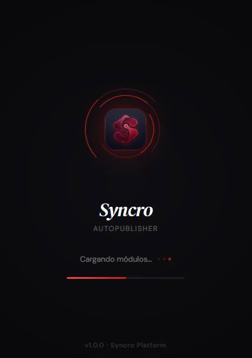
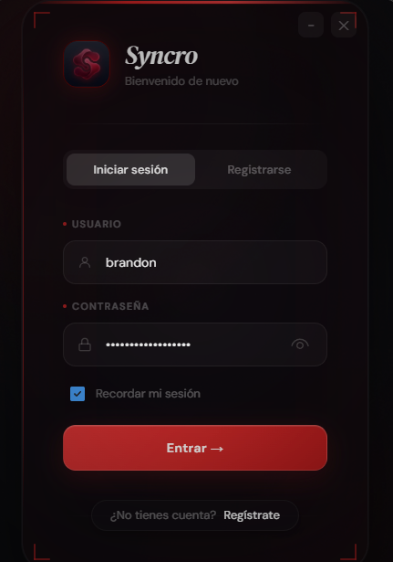
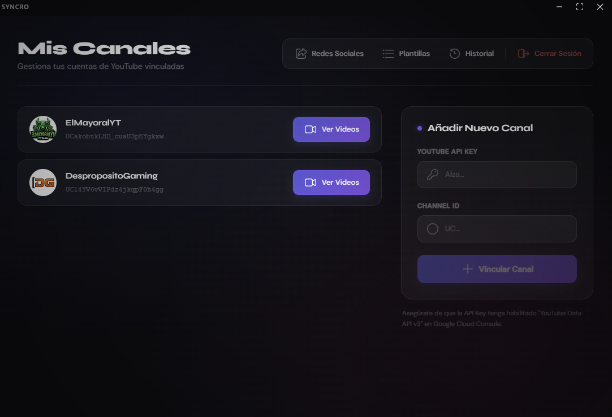
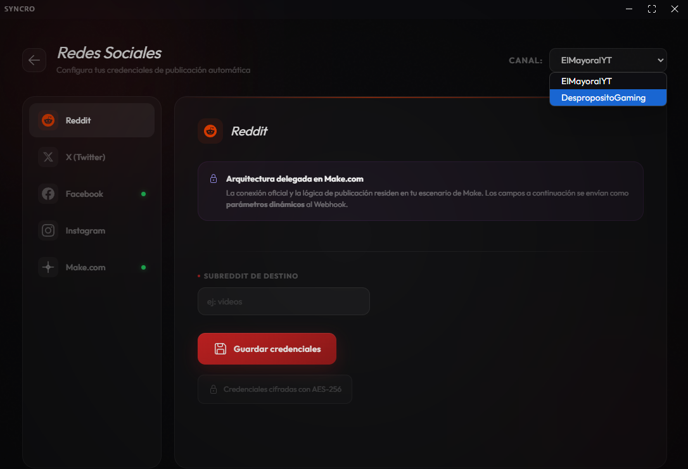
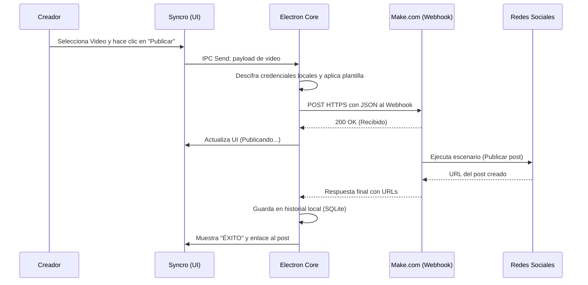

# 🚀 Syncro: YouTube AutoPublisher

<div align="center">
  
</div>

<p align="center">
  <strong>Automatiza, Gestiona y Distribuye tu contenido de YouTube como un profesional.</strong>
</p>

<p align="center">
  <a href="https://www.electronjs.org/"></a>
  <a href="https://reactjs.org/"></a>
  <a href="https://www.make.com/"></a>
</p>

---

## 🎯 Propósito del Proyecto
**Syncro** es una aplicación de escritorio multiplataforma construida con un fuerte **enfoque educativo y arquitectónico**. Nació como un ejercicio avanzado para dominar las siguientes áreas del desarrollo de software moderno:

- 🤖 **Automatización Low-Code/No-Code**: Aprender a orquestar flujos de trabajo hiper-complejos (publicar en Reddit, X, Facebook, Instagram) delegando la lógica de las APIs a un middleware robusto como **Make.com**.
- ⚛️ **Ecosistema Electron + Vite**: Construir aplicaciones de escritorio nativas que sean rápidas, seguras (usando Context Isolation) y visualmente impactantes.
- 🔐 **Seguridad en el Cliente**: Implementar criptografía local (AES-256-CBC) para garantizar que las credenciales y configuraciones sensibles del usuario nunca queden expuestas.
- ☁️ **Arquitectura Híbrida**: Diseñar un flujo de datos que combina la nube (Neon DB para autenticación global) con el almacenamiento local (SQLite para caché extrema y privacidad).

---

## ✨ Características Principales

Syncro actúa como un **centro de comando todo-en-uno** para creadores de contenido. En lugar de copiar y pegar enlaces manualmente en docenas de sitios cada vez que subes un video, Syncro te ofrece:

1. **Gestión Multicanal**: Conecta infinidad de canales de YouTube bajo una sola cuenta. Cada canal tiene su propio entorno aislado de configuración.
2. **Caché Inteligente de Contenido**: El sistema descarga y almacena localmente tus videos, Shorts y Directos, minimizando las llamadas a la API de YouTube y ahorrando cuota.
3. **Plantillas Dinámicas de Texto**: Crea *captions* predefinidos usando variables como `{titulo}` y `{url}` para que cada publicación se adapte perfectamente al estilo de la red social de destino.
4. **Despliegue Unificado (Un Clic)**: Selecciona a qué plataformas enviar tu video, y Syncro se encargará de despachar la información al webhook de Make.com de forma paralela.

---

## 📸 Recorrido por la Aplicación (Galería Detallada)

Hemos puesto un esfuerzo meticuloso en la interfaz de usuario (UI/UX), utilizando **Fluent UI** de Microsoft y **Framer Motion** para lograr una experiencia *premium*, oscura e inmersiva.

### 1. Pantalla de Carga (Splash Screen)

> **La primera impresión.** Al abrir Syncro, el sistema verifica la integridad del núcleo de Electron, inicializa las bases de datos locales (SQLite) y establece los puentes de comunicación segura (IPC). La animación de radar giratorio y pulso brinda retroalimentación visual en tiempo real mientras el motor arranca.

### 2. Autenticación y Seguridad Biométrica

> **Protección por Hardware.** El formulario de acceso no solo valida tu usuario y contraseña contra la base de datos en la nube (Neon DB), sino que también verifica el **Machine ID** de tu ordenador. Este sistema de licencias restringe el uso de la cuenta a un máximo de 3 dispositivos físicos autorizados, previniendo el abuso y compartición de cuentas.

### 3. Centro de Mando: Gestión de Canales

> **Tu hub creativo.** Aquí gestionas todos tus canales de YouTube. Puedes añadir nuevos ingresando su respectiva API Key y Channel ID. La arquitectura asegura que las credenciales de cada canal, así como sus historiales y configuraciones de redes sociales, se mantengan estrictamente separados.

### 4. Explorador de Contenido Sincronizado

> **Caché en acción.** Esta vista renderiza el grid de tus videos más recientes. Los clasifica automáticamente en *Videos*, *Shorts* o *Directos* analizando la metadata de YouTube. Las miniaturas de alta resolución se sirven de forma local de manera óptima. Si seleccionas "Publicar", inicia el flujo de automatización.

### 5. Configuración de Redes (Delegación a Make.com)

> **El cerebro de la distribución.** Aquí es donde el proyecto brilla desde una perspectiva de arquitectura. En lugar de lidiar con los constantes cambios en las APIs de Twitter o Facebook, Syncro te pide la URL de tu **Webhook de Make.com**. Al guardar, estos datos críticos se cifran localmente en tu disco duro usando **AES-256**.

### 6. Motor de Plantillas Dinámicas

> **Mensajes adaptativos.** Un video necesita diferente contexto en Twitter que en Facebook. El editor de plantillas te permite definir textos genéricos con inyección de variables (`{titulo}`). Incluye un panel inferior de *Vista Previa* en tiempo real para que veas exactamente cómo lucirá el texto final concatenado con la URL.

### 7. Confirmación Final de Lanzamiento

> **Control total antes del despegue.** Antes de ejecutar cualquier acción externa, Syncro muestra un resumen de la orden. Seleccionas con checkboxes qué plataformas específicas recibirán este video en esta ocasión particular. El botón de envío desata la llamada asíncrona al Webhook.

### 8. Historial y Auditoría Local

> **Trazabilidad completa.** Todo intento de publicación se registra localmente en SQLite. Si una publicación tiene éxito, verás un indicador verde (`ÉXITO`) junto con un botón que te lleva directamente al post generado en la red social correspondiente. Si ocurre un fallo en el webhook, quedará registrado para su depuración.

### 9. El Resultado en el Mundo Real

> **Automatización completada.** Este es un ejemplo de cómo Make.com, tras recibir el payload JSON cifrado desde Syncro, lo procesa y ejecuta la acción en la API destino (ej. Facebook). El creador acaba de distribuir su contenido en distintas redes sociales invirtiendo menos de 5 segundos de su tiempo.

---

## 🚀 Cómo funciona (Arquitectura del Flujo)



---

## 💻 Tech Stack Detallado
- **Frontend**: React 18, `@fluentui/react-components` v9 para la estética de sistema operativo, `framer-motion` para animaciones hiper-fluidas, `zustand` para manejo de estado global sin boilerplate.
- **Backend**: Electron 32 (habilitado para `contextIsolation`), Node.js.
- **Persistencia Local**: `better-sqlite3` (motor SQL ultrarrápido y síncrono).
- **Persistencia Cloud**: PostgreSQL alojado en **Neon DB** (Serverless).
- **Criptografía**: `crypto` nativo de Node.js (AES-256-CBC, BCrypt) y `node-machine-id` para fingerprinting de hardware.

---

## ⚙️ Instalación y Uso Local

Para desarrolladores que deseen clonar y estudiar la arquitectura:

1.  **Clona el repositorio**:
    ```bash
    git clone <tu-repo>
    cd youtube-autopublisher
    ```
2.  **Instala las dependencias**:
    ```bash
    npm install
    ```
3.  **Configura tu entorno**:
    Copia el archivo `.env.example` a `.env` y rellena los datos:
    ```env
    DATABASE_URL=postgresql://... # Tu instancia de Neon DB
    ENCRYPTION_KEY=...            # Clave de 32 caracteres
    ```
4.  **Migra la base de datos remota**:
    ```bash
    npm run migrate
    ```
5.  **Inicia el entorno de desarrollo** (Iniciará Vite y Electron simultáneamente):
    ```bash
    npm run electron:dev
    ```

---

> [!NOTE]
> **Renuncia de Responsabilidad Educativa**: Este software se provee como un caso de estudio arquitectónico sobre integración de aplicaciones de escritorio con automatización de flujos. El desarrollador no se hace responsable por el mal uso de las APIs de terceros o bloqueos de cuentas por automatización agresiva.

<div align="center">
  <p>Desarrollado con ❤️ para la comunidad de creadores y desarrolladores.</p>
</div>
